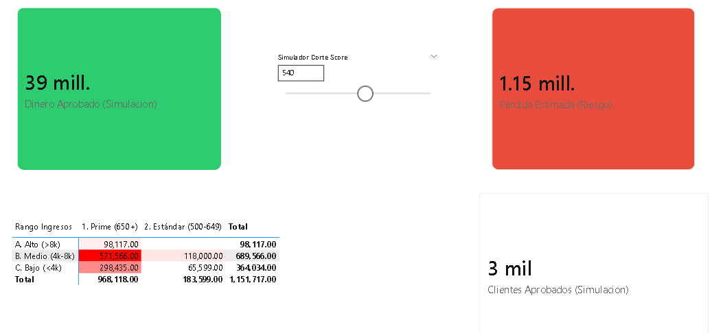
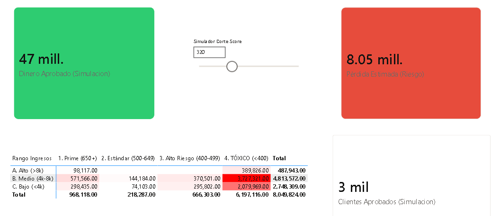

# 📊 Nexus Finance: Credit Risk Intelligence & Analytics Module

## 📝 Descripción General

Este módulo representa la capa de **Inteligencia de Negocios (BI)** de la plataforma Nexus Finance. Su objetivo es transformar las predicciones probabilísticas del motor de IA (`nexus-risk-engine`) en estrategias financieras accionables.

A diferencia de los reportes estáticos tradicionales, este Dashboard implementa un modelo dinámico que permite a la gerencia simular escenarios de riesgo, definir puntos de corte (Cut-offs) óptimos y visualizar la salud de la cartera de crédito en tiempo real.

---

## 🏗️ Arquitectura de Datos (ETL Pipeline)

El flujo de datos sigue una arquitectura de **Batch Scoring** para enriquecer la información antes de la visualización:

1.  **Extraction & Modeling (Python):** El servicio `RiskEvaluator` utiliza un modelo **Random Forest** para predecir la probabilidad de impago de cada solicitud histórica.
2.  **Enrichment (Python/Pandas):** Se genera un _Dataset Analítico_ (`nexus_bi_data.csv`) que transforma las probabilidades crudas (0.0 - 1.0) en un **Score Comercial (300-850)** y asigna niveles de riesgo.
3.  **Visualization (Power BI):** Power BI consume el dataset procesado, modelando los datos en un Esquema de Estrella y utilizando **DAX** para cálculos financieros en memoria.

---

## 🚀 Funcionalidades Clave

### 1. Simulador de Escenarios "What-If"

Un motor de simulación interactivo que permite ajustar el **Score de Corte** (Threshold) en tiempo real.

- **KPIs Dinámicos:** Al mover el deslizador, el sistema recalcula instantáneamente el **Volumen de Colocación** vs. **Pérdida Esperada (Expected Loss)**.
- **Valor:** Permite encontrar el equilibrio exacto entre agresividad comercial y prudencia financiera sin necesidad de re-entrenar el modelo.

### 2. Matriz de Calor de Riesgo (Risk Heatmap)

Visualización estratégica que cruza **Nivel de Ingresos** vs. **Rango de Score**.

- **Segmentación:** Uso de _Binning_ estadístico para agrupar clientes en clusters (Prime, Estándar, Tóxico).
- **Detección de Anomalías:** Identificación visual de concentraciones de deuda incobrable.

### 3. Métricas Financieras

- **Exposición al Riesgo:** Cálculo monetario de la pérdida potencial basada en la probabilidad inversa de aprobación.
- **Tasa de Aprobación Real:** Porcentaje de la cartera que califica según los criterios ajustados.

---

## 💡 Insights de Negocio Descubiertos

Gracias a este análisis, se definieron las siguientes reglas de negocio para el motor de decisión:

- **⛔ Bloqueo de Activos Tóxicos:** Se identificó que el segmento con **Score < 400** e **Ingresos < $4k** representa una pérdida desproporcionada (Zona Roja en el Heatmap). Se recomienda rechazo automático.
- **🎯 Sweet Spot de Rentabilidad:** El análisis de sensibilidad muestra que el punto óptimo de corte se encuentra entre **500 y 580 puntos**, donde se maximiza el volumen de clientes con un incremento marginal del riesgo.
- **⚠️ Gestión de Volumen Prime:** El segmento de "Ingresos Medios" con buen Score acumula la mayor exposición monetaria debido al alto volumen, requiriendo estrategias de fidelización para mitigar fugas.

---

## 🛠️ Stack Tecnológico

- **Core:** Microsoft Power BI Desktop
- **Lenguajes:** DAX (Data Analysis Expressions), M (Power Query).
- **Data Source:** CSV generado por Python (Scikit-Learn/Pandas).
- **Modelado:** Star Schema, Medidas Dinámicas, Parámetros Desconectados.

---

## 📸 Galería del Dashboard

### 🔹 Tablero de Control y Simulador

_Vista general del simulador de corte y KPIs financieros._


### 🔹 Matriz de Riesgo (Heatmap)

_Análisis de concentración de pérdida por segmento de ingresos y score._


---

## 📦 Instalación y Uso

1.  Asegúrate de haber ejecutado el script de entrenamiento para generar los datos:
    ```bash
    cd nexus-risk-engine
    python train_risk_model.py
    ```
2.  Abre el archivo `Nexus_Risk_Dashboard.pbix` con **Power BI Desktop**.
3.  Si es necesario, actualiza la ruta del archivo `nexus_bi_data.csv` en la configuración de origen de datos.
